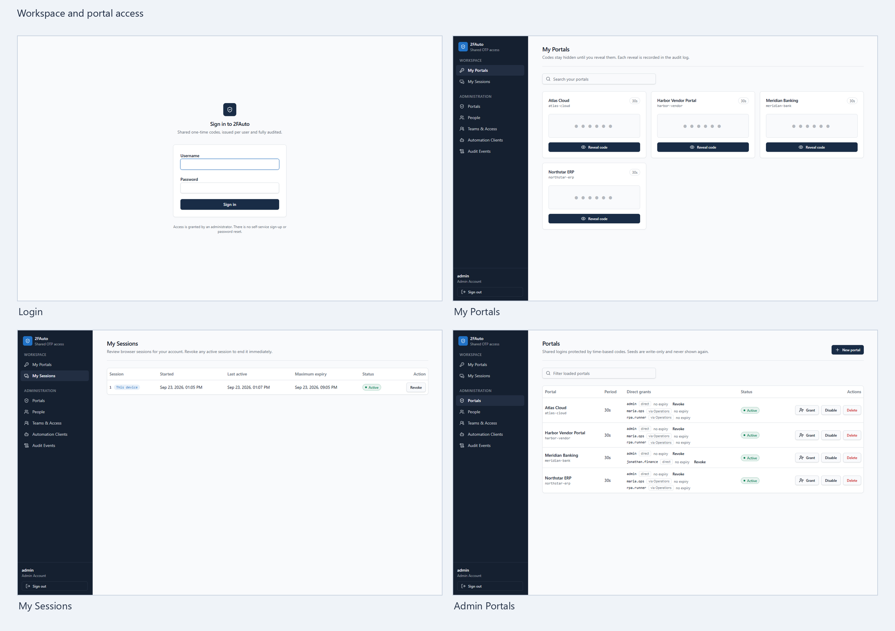
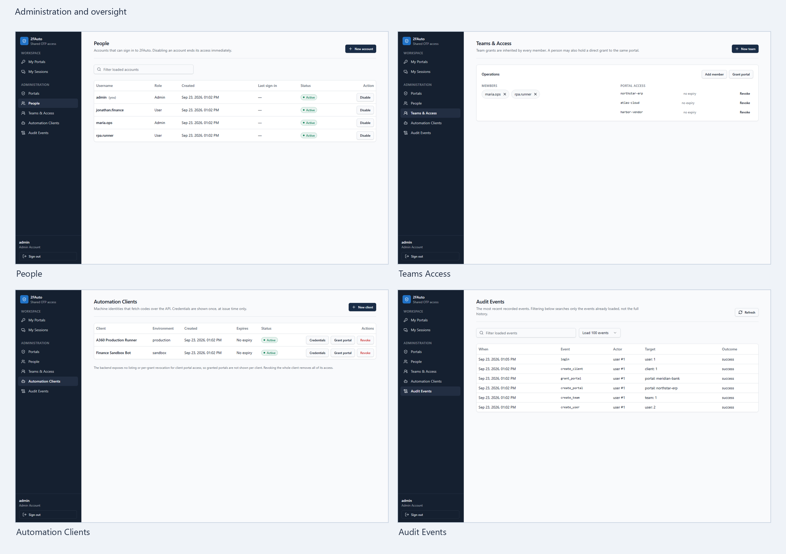

# 2FAuto

**Shared one-time codes for people and automation, with access controls and an audit trail.**

2FAuto combines a FastAPI TOTP service with the React **Secure Access Hub**. Administrators register portal secrets, grant access to users or teams, and issue scoped credentials to automation clients. People see only their assigned portals; codes stay hidden until explicitly revealed. The repository retains the original server-rendered pages and an Automation Anywhere A360 helper.

> The screenshots use fictional names and a separate test-only database. No OTP values, credentials, or production data are included.

## Product tour





| Screen | Purpose |
| --- | --- |
| [Sign in](docs/assets/screenshots/01-login.png) | Starts an opaque, revocable browser session. |
| [My Portals](docs/assets/screenshots/02-my-portals.png) | Shows granted portals and reveals one code at a time. |
| [My Sessions](docs/assets/screenshots/03-my-sessions.png) | Shows active, expired, and revoked sessions and revokes active sessions. |
| [Portals](docs/assets/screenshots/04-admin-portals.png) | Registers encrypted TOTP seeds and manages grants. |
| [People](docs/assets/screenshots/05-people.png) | Creates and manages administrators and business users. |
| [Teams & Access](docs/assets/screenshots/06-teams-access.png) | Grants portal access through team membership. |
| [Automation Clients](docs/assets/screenshots/07-automation-clients.png) | Manages clients, portal grants, and one-time visible credentials. |
| [Audit Events](docs/assets/screenshots/08-audit-events.png) | Reviews recent authentication and access activity. |

## Run with Docker Compose

Compose runs the API, a Node build of Secure Access Hub, and a Caddy gateway. The gateway puts the UI and API on one origin so browser cookies and same-origin CSRF checks work together. SQLite data lives in a named volume.

1. Install Docker with Compose. Copy `.env.example` to `.env` and replace the sample values for `ADMIN_PASSWORD`, `SESSION_SECRET`, and `SECRET_ENCRYPTION_KEY`. Generate random values with:

   ```bash
   python -c "import secrets; print(secrets.token_urlsafe(32))"
   python -c "import base64, secrets; print(base64.urlsafe_b64encode(secrets.token_bytes(32)).decode())"
   ```

   Use the first command for the session secret and a unique admin password; use the second for the encryption key. Keep `.env` private. `OTP_SECRET` and `API_KEY` are only needed for optional legacy endpoints.

2. Start from the repository root:

   ```bash
   docker compose up --build -d
   docker compose ps
   ```

3. Open [http://localhost:8080/login](http://localhost:8080/login) and sign in using the admin account in `.env`. The first admin is created on initial startup. Check `http://localhost:8080/ready` or run `docker compose logs -f` when diagnosing startup.

4. Stop with `docker compose down`. The `otp_data` volume persists across restarts and image rebuilds. Back up the database volume and its matching encryption key together.

The bundled gateway binds only to `127.0.0.1:8080` for local development. For a public deployment, provide HTTPS at the gateway, set `APP_ENV=production`, `COOKIE_SECURE=true`, and `ENABLE_DOCS=false`, and configure your public domain and trusted proxy. Production startup rejects insecure sample settings. Do not expose the API container directly.

## Run locally without Docker

Requirements: Python 3.11+, Bun 1.4+, and a filled-in `.env` copied from `.env.example`.

```bash
python -m pip install -r requirements.txt
python -m uvicorn app.main:app --host 127.0.0.1 --port 8000
```

In another terminal:

```bash
cd "Secure Access Hub"
bun install --frozen-lockfile
bun run dev --host 127.0.0.1 --port 5173
```

Open `http://127.0.0.1:5173/login`. The Vite development bridge forwards API requests to `http://localhost:8000`; set `VITE_BACKEND_ORIGIN` before starting Vite if the API uses another origin. The original FastAPI pages remain available on port 8000. During development, set `ENABLE_DOCS=true` to enable `/docs` on the API origin.

## Roles and access

- **Administrators** create portals, users, teams, grants, and automation clients. The final active administrator cannot be disabled. Sensitive changes require a recent password step-up.
- **Users** see only portals granted directly or through an active team. Portal lists contain no codes. Each reveal is audited, kept in transient page memory, and hidden when its TOTP window expires.
- **Automation clients** use scoped bearer credentials and per-portal grants. A newly issued token is visible once; store it in the automation platform's credential vault. The global API key routes are disabled unless `LEGACY_API_ENABLED=true`.

Each portal uses a Base32 TOTP seed matching its external MFA account. Seeds are encrypted with AES-GCM before SQLite storage. Portal names are lowercase slugs such as `vendor-login`; periods may be 10–120 seconds. The UI does not show saved seeds again. See the [OTP Portal User Guide](docs/OTP-PORTAL-USER-GUIDE.md) for an end-user walkthrough.

## API and automation

| Endpoint | Access | Purpose |
| --- | --- | --- |
| `GET /health`, `GET /ready` | Public | Liveness and readiness. |
| `POST /api/v1/auth/login` | Username and password | Starts a browser session. |
| `GET /api/v1/me` | Browser session | Current user, role, and CSRF token. |
| `GET /api/v1/me/sessions` | Browser session | Own session history. |
| `GET /api/ui/portals` | Browser session | Authorized portal metadata. |
| `POST /api/ui/portals/{portal_name}/otp` | Browser session and CSRF | Reveals one authorized code. |
| `POST /api/v1/portals/{portal_name}/otp` | Scoped bearer credential | Returns one client-granted code. |
| `GET /api/v1/audit` | Administrator session | Recent audit events. |
| `/otp`, `/otp/{portal_name}`, `/otp/verify`, `/otp/secure` | Legacy API key | Compatibility routes, disabled by default. |

Example scoped client request:

```python
import os
import requests

response = requests.post(
    "http://localhost:8080/api/v1/portals/vendor-login/otp",
    headers={"Authorization": f"Bearer {os.environ['OTP_CLIENT_TOKEN']}"},
    timeout=10,
)
response.raise_for_status()
print(response.json()["otp"])
```

`totp_a360.py` is a standalone Automation Anywhere A360 helper. With `OTP_SERVICE_URL` and `OTP_CLIENT_TOKEN` supplied by its credential store, run `python totp_a360.py vendor-login`; it prints the code as a string, preserving leading zeroes. Keep automation traffic on a trusted network or behind HTTPS.

## Security and operations

- Browser sessions use opaque server-side records, `HttpOnly` and `SameSite=Lax` cookies, a 15-minute idle limit, an 8-hour absolute limit, revocation, CSRF tokens, and same-origin checks. Set `COOKIE_SECURE=true` when served over HTTPS.
- Portal reveals and client grants are checked on the server. OTP values are absent from portal lists and browser storage. Revoking a grant or session blocks further access.
- Keep `SECRET_ENCRYPTION_KEY` outside the database, protect backups, and retain old key versions when rotating it.
- The API Docker image runs as a non-root user. `/docs` is development only. Legacy API key access is off by default; its HMAC timestamp window limits age but does not prevent reuse inside that window.
- Run `python -m pytest -q` for the backend suite. The frontend build command is `bun run build` in `Secure Access Hub/`; Docker targets Nitro's `node-server` preset while the normal Lovable build remains unchanged.

## Repository map

```text
app/                         FastAPI routes, auth, TOTP, SQLite, templates
Secure Access Hub/           TanStack Start frontend and frontend Dockerfile
deploy/Caddyfile             Same-origin gateway routing for Compose
compose.yaml                 API, web, gateway, and persistent SQLite volume
totp_a360.py                 A360 scoped-client CLI helper
tests/                       Backend tests
docs/                        User guide and demo screenshots
.env.example                 Configuration template
```
