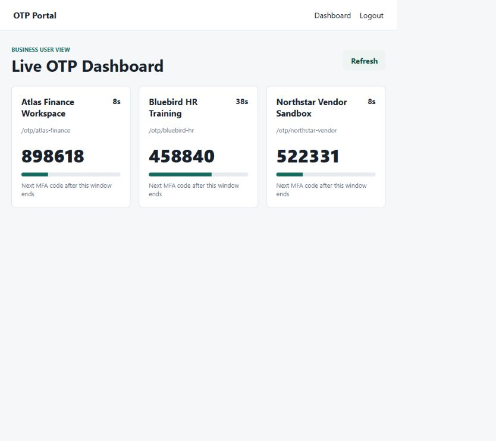
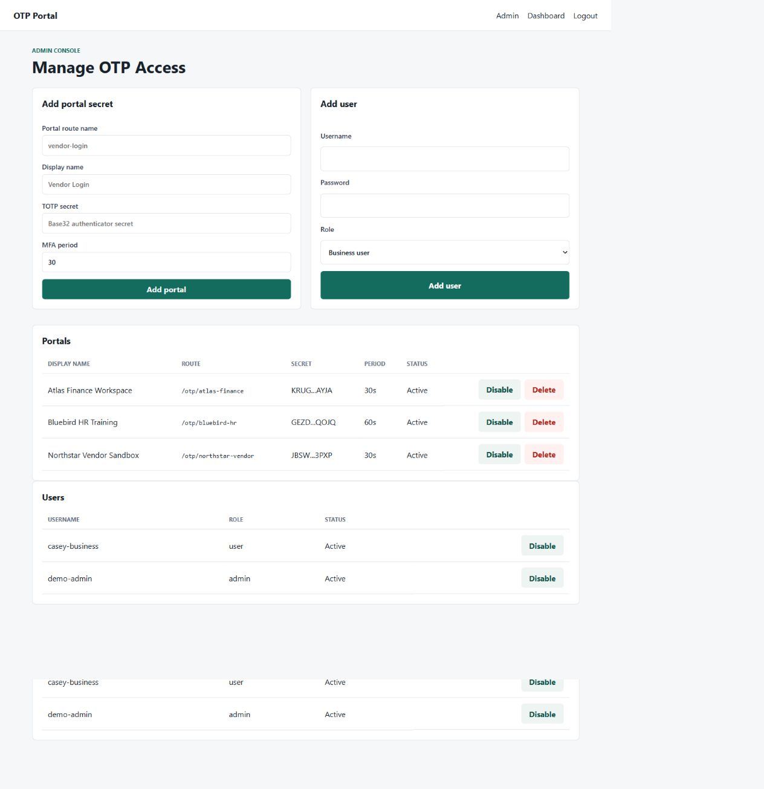

# OTP Portal: Business and RPA User Guide

This guide explains how to use the OTP Portal in everyday business language.
It is for teams who share access to third-party websites protected by a
time-based one-time password (TOTP), and for RPA developers who need a code
inside an automation flow.

All screenshots in this guide use fictional provider names, test users, and
test-only OTP secrets.

## What problem does this solve?

Many vendor, banking, HR, and enterprise portals ask for a new six-digit code
when someone signs in. The OTP Portal provides one controlled place where an
administrator can register that portal's TOTP secret. Approved people can view
the changing code in a browser, and approved automations can request it through
an API.

The portal is useful when a shared business account is used by more than one
person or by an RPA bot. It avoids manually checking an authenticator app and
passing codes between people.

## Who uses the portal?

| Role | What they do |
|---|---|
| Administrator | Adds and manages portal OTP entries, creates users, and disables entries that are no longer needed. |
| Business user | Signs in to view live OTP codes on the dashboard. |
| RPA developer | Calls a protected endpoint to receive an OTP during a bot run. |
| Bot owner | Owns the automation account and confirms that it uses the correct portal route and API key. |

## How it works

1. An administrator registers a provider portal, such as a vendor workspace.
2. The administrator gives it a clear display name and route name, for example
   `northstar-vendor`.
3. A business user opens the dashboard, or an automation calls the matching API
   route.
4. The service creates the current six-digit OTP from the registered secret.
5. The user or bot enters the code in the third-party provider before the
   countdown reaches zero.

The code changes on the provider's configured MFA schedule, usually every
30 seconds.

## Business user: viewing a code

1. Open the portal's `/login` page.
2. Sign in with the username and password supplied by the administrator.
3. You will land on the Live OTP Dashboard.
4. Find the provider card you need.
5. Enter the six-digit code in the provider website before the countdown ends.
6. Wait for the next code if there are only a few seconds remaining.
7. Use **Refresh** when you need to reload the current data.



The dashboard updates the visible countdown every second. It requests a fresh
code from the server when the MFA window changes, so it does not continually
refresh the page.

### Important current behavior

This version is intended for private-network testing. A signed-in business user
can currently see every active portal configured by the administrator. It does
not yet support per-user or per-team portal permissions. Only provide accounts
to people who are allowed to use all currently configured shared portals.

## Administrator: setting up portal access

Open `/login` and sign in with the administrator account. You will be sent to
the **Manage OTP Access** page.

### Add a provider portal

Enter the following information:

| Field | Meaning | Example |
|---|---|---|
| Portal route name | The stable API-friendly name for the provider. Use lowercase letters, numbers, and hyphens. | `northstar-vendor` |
| Display name | The name people see in the dashboard. | `Northstar Vendor Sandbox` |
| TOTP secret | The Base32 secret issued when the provider's authenticator MFA was enrolled. | Supplied by the provider setup process |
| MFA period | How often the provider changes the code. | `30` seconds |

Portal route names must contain 2–64 lowercase letters, numbers, or hyphens.
The MFA period must be between 10 and 120 seconds. Once saved, the portal list
shows only a masked version of the secret.

### Add a business user

Use the **Add user** form to create a username and a password with at least
eight characters. Select **Business user** for people who only need the OTP
dashboard. Select **Admin** only for people who need to manage portal entries
or other users.

### Disable or delete a portal

- **Disable** stops the portal from appearing in the business dashboard and
  from being available through its API route. The portal record remains in the
  database.
- **Delete** removes the portal record. Use it only when the entry is no longer
  required.

The application prevents the last active administrator from being disabled.



## RPA developer: retrieve a portal OTP

Use the portal-specific endpoint when the bot needs a code. The bot does not
need to know the TOTP secret; it requests the current code by route name.

```text
GET /otp/{portal_name}
Header: X-API-Key: your-api-key
```

Example using Python:

```python
import requests

response = requests.get(
    "http://localhost:8000/otp/northstar-vendor",
    headers={"X-API-Key": "your-api-key"},
    timeout=10,
)
response.raise_for_status()

payload = response.json()
otp = payload["otp"]
seconds_left = payload["valid_for_seconds"]

if seconds_left < 10:
    # Wait for the next MFA window, then request a fresh code.
    # Keep the wait bounded by your bot's own timeout policy.
    pass

print(otp)
```

The response includes these values:

```json
{
  "otp": "482910",
  "valid_for_seconds": 18,
  "period": 30,
  "timestamp": 1700000012,
  "portal_name": "northstar-vendor",
  "display_name": "Northstar Vendor Sandbox"
}
```

Treat `otp` as a string because valid codes can start with zero. Check
`valid_for_seconds` before submitting a provider form: a bot should request a
fresh code rather than submitting one that is about to expire.

### Automation Anywhere A360 helper

The repository includes `totp_a360.py`, a small helper that prints a current
TOTP to standard output for an existing A360 command-line integration:

```bash
python totp_a360.py YOUR_BASE32_TOTP_SECRET
```

For multi-portal use, prefer the server endpoint above. Passing a real seed as
a command-line argument can expose it to local process monitoring or execution
logs.

## Safe daily use

- Use the portal only over the approved private network or HTTPS deployment.
- Do not paste a TOTP secret, API key, password, or OTP code into chat, ticket,
  email, or public documentation.
- Do not share administrator accounts.
- Use clear provider names that identify the business system and environment.
- Disable a portal or user as soon as access is no longer needed.
- Report unexpected codes, unfamiliar portal entries, or failed logins to the
  portal administrator.
- A code that expires cannot be reused. Wait for the next countdown cycle.

## Common questions

### The provider rejects the code. What should I do?

First check that you selected the correct provider card and that the code was
entered before it expired. Refresh the dashboard or wait for the next MFA
window. If the issue continues, ask the administrator to verify the registered
secret, MFA period, and the provider account's authenticator setup.

### I cannot see a provider card.

The entry may be disabled, deleted, or not yet configured. Contact an
administrator.

### The dashboard shows no portal cards.

No active provider portals are configured. An administrator needs to add or
reactivate one.

### The bot receives `401` or `403`.

Check that the bot sends the `X-API-Key` header and that the configured API key
matches the server setting. Do not put the key directly in source code; load it
from the automation platform's secure credential store.

### The bot receives `404` for a portal route.

Confirm the route name. It must match the administrator's portal route exactly,
for example `northstar-vendor`.

## Quick technical reference

| Endpoint | Who uses it | Authentication |
|---|---|---|
| `GET /health` | Monitoring or setup checks | None |
| `GET /otp` | Existing single-secret automations | `X-API-Key` |
| `GET /otp/{portal_name}` | Portal-specific RPA flows | `X-API-Key` |
| `POST /otp/verify` | Existing single-secret validation flows | `X-API-Key` |
| `GET /otp/secure` | Existing HMAC-signed integrations | API key, timestamp, and signature |
| `GET /api/ui/otps` | Browser dashboard | Signed login session |

For local setup, Docker usage, environment variables, and the complete API
reference, see the repository [README](../README.md).
